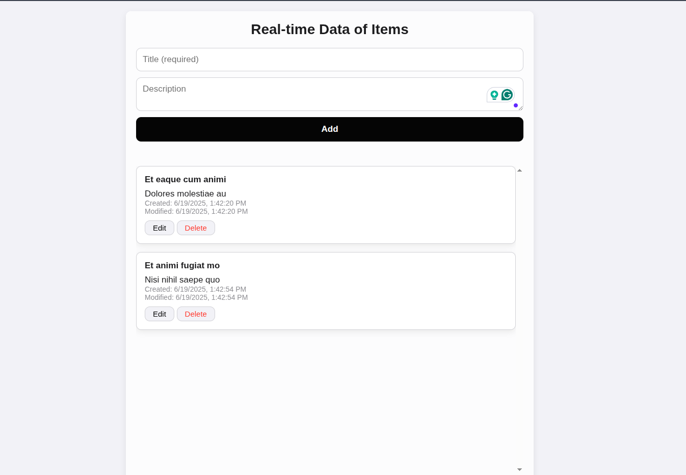

# **Real-time Items Management System**  
**A Node.js, MySQL, Socket.io, and Sequelize Application**  

This project is a **real-time CRUD (Create, Read, Update, Delete) application** that allows users to manage items with live updates across all connected clients using **Socket.io**. It uses **Sequelize** (an ORM for MySQL) for database operations and **Express.js** for the backend server.

---

# Output


## **📌 Key Features**
✅ **Real-time updates** (using **Socket.io**)  
✅ **MySQL Database** (managed via **Sequelize ORM**)  
✅ **RESTful API** for CRUD operations  
✅ **Scalable folder structure** (MVC pattern)  
✅ **Form validation** (title is required)  
✅ **Automatic timestamps** (created & modified)  
✅ **Static file serving** (HTML, CSS, JS for frontend)  

---

## **🚀 How to Start the Project**
### **1️⃣ Prerequisites**
- **Node.js** (v18+ recommended)  
- **MySQL Server** (installed and running)  
- **npm** (comes with Node.js)  

### **2️⃣ Installation Steps**
#### **1. Clone the project (if applicable)**
```bash
git clone <your-repo-url>
cd crude-items-app
```

#### **2. Install dependencies**
```bash
npm install
```

#### **3. Set up the database**
- Create a MySQL database named `items_db`:
  ```bash
  mysql -u root -p -e "CREATE DATABASE items_db"
  ```
- Update `.env` file with your MySQL credentials:
  ```env
  DB_USER=your_mysql_username
  DB_PASSWORD=your_mysql_password
  DB_NAME=items_db
  DB_HOST=localhost
  PORT=3000
  NODE_ENV=development
  ```

#### **4. Start the application**
```bash
npm run dev  # Development mode (with nodemon)
# OR
npm start   # Production mode
```

#### **5. Access the application**
- Open your browser and go to:  
  🔗 **http://localhost:3000**

---

## **📂 Project Structure**
```
src/
├── config/        # Database configuration
├── controllers/   # Business logic
├── models/        # Sequelize models
├── routes/        # API endpoints
├── utils/         # Helper functions
├── app.js         # Main server file
public/            # Frontend files (HTML, CSS, JS)
```

---

## **🔌 API Endpoints**
| Method | Endpoint        | Description                     |
|--------|----------------|--------------------------------|
| GET    | `/api/items`   | Get all items                  |
| GET    | `/api/items/:id` | Get a single item by ID       |
| POST   | `/api/items`   | Create a new item              |
| PUT    | `/api/items/:id` | Update an item by ID         |
| DELETE | `/api/items/:id` | Delete an item by ID         |

---

## **⚡ Real-time Events (Socket.io)**
- **`item_created`** → When a new item is added  
- **`item_updated`** → When an item is modified  
- **`item_deleted`** → When an item is removed  

All connected clients receive **instant updates** without page refresh.

---

## **🛠 Troubleshooting**
- **MySQL connection issues?**  
  - Ensure MySQL is running (`sudo service mysql status`).  
  - Verify `.env` credentials.  
  - Check if the user has database access.  

- **Sequelize errors?**  
  - Delete `node_modules` and reinstall (`rm -rf node_modules && npm install`).  
  - Check model definitions for typos.  

- **Socket.io not working?**  
  - Ensure the client connects to the correct server URL.  
  - Check browser console for WebSocket errors.  

---

## **📜 License**
MIT License - Free to use and modify.

---

### **🎯 Summary**
This project demonstrates **real-time data management** with **Node.js + MySQL + Socket.io**, following best practices for **scalability** and **maintainability**.  

🚀 **Happy Coding!** 🚀